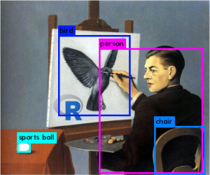

# image -  Computer Vision and Image Recognition algorithms for R users 

This repository contains a suite of R packages which perform image algorithms currently not available in other R packages like [magick](https://CRAN.R-project.org/package=magick), [imager](https://CRAN.R-project.org/package=imageR) or [EBImage](https://bioconductor.org/packages/release/bioc/html/EBImage.html). 

These algorithms are put into different packages because of license differences. Currently the following R packages are available:

| Package           | Functionality                          | License     | Details|
|-------------------|----------------------------------------|-------------|--------|
| **image.CornerDetectionF9**    | FAST-9 corner detection for images     | BSD-2   | [Details](image.CornerDetectionF9)       |
| **image.CornerDetectionHarris**| Harris corner detection for images     | BSD-2   | [Details](image.CornerDetectionHarris)   |
| **image.LineSegmentDetector**  | Line Segment Detector (LSD) for images | AGPL-3  | [Details](image.LineSegmentDetector)     |
| **image.ContourDetector**      | Unsupervised Smooth Contour Line Detection for images | AGPL-3  | [Details](image.ContourDetector)     |
| **image.CannyEdges**           | Canny Edge Detector for Images         | GPL-3   | [Details](image.CannyEdges)              |
| **image.Otsu**                 | Otsu's Image Segmentation Method       | MIT     | [Details](image.Otsu)                    |
| **image.dlib**                 | Speeded up robust features (SURF) and histogram of oriented gradients (HOG) features | AGPL-3 | [Details](image.dlib)     |
| **image.darknet**              | Image classification using darknet with deep learning models AlexNet, Darknet, VGG-16, Extraction (GoogleNet) and Darknet19. As well object detection using the state-of-the art YOLO detection system | MIT   | [Details](image.darknet)        |
| **image.OpenPano**             | Image Stitching                        | see file LICENSE | [Details](image.OpenPano)       |
| **image.DenoiseNLMeans**       | Non-local means denoising              | see file LICENSE | [Details](image.DenoiseNLMeans) |

More packages and extensions are under development.

A presentation given at the useR-2017 conference is available in file [presentation-user2017.pdf](presentation-user2017.pdf) 



## Installation

Install all packages

```
install.packages("devtools")
install.packages("dlib")
devtools::install_github("bnosac/image", subdir = "image.CornerDetectionF9", build_vignettes = TRUE)
devtools::install_github("bnosac/image", subdir = "image.CornerDetectionHarris", build_vignettes = TRUE)
devtools::install_github("bnosac/image", subdir = "image.LineSegmentDetector", build_vignettes = TRUE)
devtools::install_github("bnosac/image", subdir = "image.ContourDetector", build_vignettes = TRUE)
devtools::install_github("bnosac/image", subdir = "image.CannyEdges", build_vignettes = TRUE)
devtools::install_github("bnosac/image", subdir = "image.Otsu", build_vignettes = TRUE)
devtools::install_github("bnosac/image", subdir = "image.dlib", build_vignettes = TRUE)
devtools::install_github("bnosac/image", subdir = "image.darknet", build_vignettes = TRUE)
```

Have a look at some vignettes
```
vignette("image_corner_detector_f9", package = "image.CornerDetectionF9")
vignette("image_line_segment_detector", package = "image.LineSegmentDetector")
vignette("image_contour_detector", package = "image.ContourDetector")
vignette("image_canny_edges", package = "image.CannyEdges")
```


## Support in image recognition

Need support in image recognition?
Contact BNOSAC: http://www.bnosac.be

