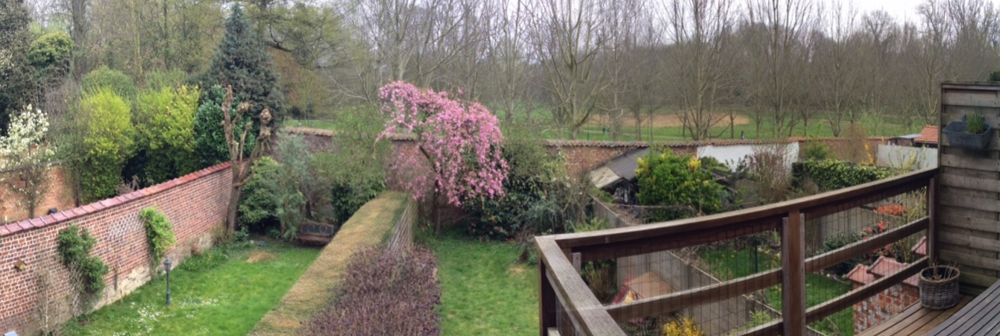

# image.OpenPano - Stitching images

## Example

Stitches images.

```r
library(image.OpenPano)

folder <- system.file(package = "image.OpenPano", "extdata")
images <- c(file.path(folder, "imga.jpg"), 
            file.path(folder, "imgb.jpg"),
            file.path(folder, "imgc.jpg"))
result <- image_stitch(images, file = "result_stitched.jpg")

library(magick)
image_read(images[1])
image_read(images[2])
image_read(images[3])
image_read("result_stitched.jpg")
```



